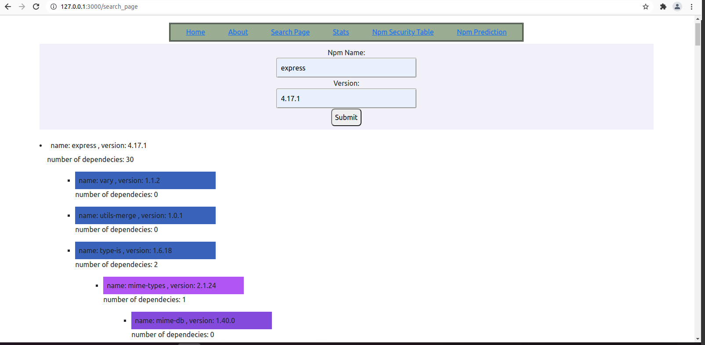
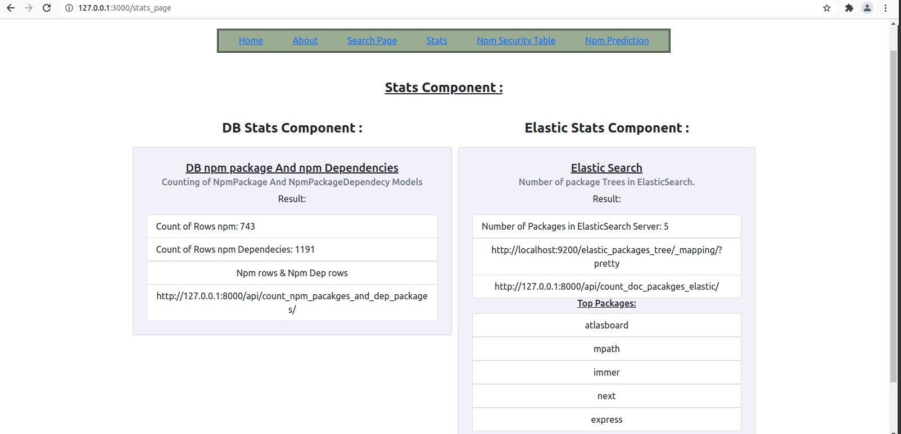

# Search Npm Package Tree :

**Notice:**  
**calling npmjs https://registry.npmjs.org/keyword/latest is being Throttling by them, so when doing search write package with little dependecies ...**

The project will search for package in npmjs and will insert  to DB, and could be searach by 1)ElasticSearch 2)DB-postgres 3)api- https://registry.npmjs.org/{package_name}/{version}  .  
Each package will show also his dependency, so it will look like package tree.

### Remote Npmjs API/Scraping:  
**Best approach is to Clone whole NPM metadata DB server with IT tools**
we have api call limit. so, i wont add threading when scraping, or if i will add it will be a few (and none recursivly).     

need to add:

- ~~Full recursive tree view - Front end~~ - Done    
- tests
- ~~periodic celery task. currently by url call:~~
 http://127.0.0.1:8000/celery_task_updating_npm_packages_and_dependecies and also periodically(timing in our setting py file )  
- split db and call for api by threading.
- ~~good looking UI added colors. need to add:  search being made message  when in searching process.~~
with:  https://steemit.com/utopian-io/@jfuenmayor96/show-a-loading-animation-while-your-elements-are-loading-in-react
- optimise adding to model 
- refine code so it will be fit for different languages libraries (pipy - python, nugat-c#  and more.....)
- ~~Caching with elasticsearch. search hierarcy: 1)caching- elasticsearch 2) DB 3) api call/scraping~~ 
- security for password in production - (not matter now)
- website data coruption- when runing task could be situation of all db ruin if the website destionation will decide to change there package data answering.
- ~~block searching all  Npm Packages in Back end - to change from viewsets in packages__app/api/view ...~~( not matter now)
- logging on DB or on file
- ~~async function fetch on Front end.~~ 

~~In elasticsearch container:
in shell post ->   
 curl -XPUT 'localhost:9200/elastic_packages_tree?pretty'  
The command will make index (that will correlate to index in settings file)~~ 
checking every  search in code and create if not exists, need to change to make on server restart, or on elasticsearch image built.  

Elastic :   
   >showing Documents in index:  
    >>  http://localhost:9200/elastic_packages_tree/_search  

   > delete index from elastic container shell
    >>  curl -XDELETE 0:9200/elastic_packages_tree

