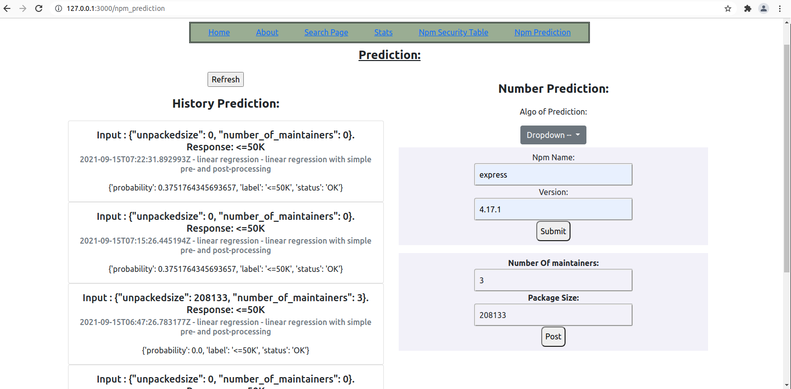

# Npm Security:


## Predicton:
--------------

Bsed on https://www.deploymachinelearning.com/  


I made in ML basic readiness, for runing prediction.

Proposition:  
-------------

based on DB data that have been fetched from npm regstries, make claim on security by linear regression ML.

looking on NpmSecurityPackageDeatails model in packages__app:
> it has fields:
    >> - unpackedsize
    >> - number_of_maintainers
    >> - license (will be added in the future)

we will train our model based on those field and if they have security problem, then we will make prediction
 on new packages data to see what are there chances.

The proposition results need more investigation to see the correctness of the claim ...




## Npm Security Deatial:
-------------------------

> NpmSecurityPackageDeatails model in packages__app that will have fields:  

    npm_package = models.ForeignKey(NpmPackage, on_delete=models.CASCADE)
    number_of_maintainers = models.IntegerField(default = 1 , null =True)
    unpackedsize = models.IntegerField(null =False, blank =True, default= 0) # IntegerField - can hold up to 268 MB
    license = models.CharField(max_length=36, null=True, blank=True, default= '' )
    updated_at = models.DateField( auto_now=True)
    is_exploite = models.BooleanField()
    num_high_severity = models.IntegerField(default = 0 , null =True, blank =True)
    num_moderate_severity = models.IntegerField(default = 0 , null =True, blank =True)
    num_low_severity = models.IntegerField(default = 0 , null =True, blank =True)
    num_info_severity = models.IntegerField(default = 0 , null =True, blank =True)
    num_critical_severity = models.IntegerField(default = 0 , null =True, blank =True)


the data will be aquire from:

for example:  
    https://registry.npmjs.org/immer/9.0.6

And from security details:  

```javascript
const regFetch = require('npm-registry-fetch');

var keyword = process.argv[2];
var version = process.argv[3];

// console.log( typeof keyword  +  keyword + '\n');
// console.log( typeof  version +  version + '\n');

var req = {}
req[keyword] = version ;

var d = {};
var ver = {};
ver['version'] = version;

d[keyword] = ver ;

var auditData = {
    "name": "npm_audit_test",
    "version": "1.0.0",
    "requires": {
    },
    "dependencies": {
    }
};

auditData['requires'] = req;
auditData['dependencies'] = d;

//console.log( ' auditData :  \n   '+ auditData['dependencies'] + ' \n \n'  );

let opts = {
    "color":true,
    "json":true,
    "unicode":true,
    method: 'POST',
    gzip: true,
    body: auditData
};

return regFetch('/-/npm/v1/security/audits', opts)
    .then(res => {
        return res.json();
    })
    .then(res => {
        console.log(' \n');
        console.log(JSON.stringify(res, "", 3));
  }).catch(err => console.error(err));
```


need to add:

- celery creating new ml file, plus making the file from the FE
- testing
- auto updating predict history on search
- add Number Of maintainers, Package Size to be change by hand (manually) 
- make history prediction nicer
- put load_data_startup.py not in url .py
- check what root cause in duplications in Mlalgorithms
- add field classifier to Mlalgorithms serialization (method , like in current_status ..)
- seeing endpoints model in FE and have the ability to change them.
- make A/B testing ability FE/BE
- add field license to linear regression and see the result.
- make http://mpld3.github.io/ , D3 Renderings of Matplotlib Graphics -  to the front end  to see how our data looks.
https://github.com/mpld3/mpld3/tree/master/examples
https://stackoverflow.com/questions/53388276/from-flask-how-to-send-the-matplotlib-plot-image-into-json-object
- research the data